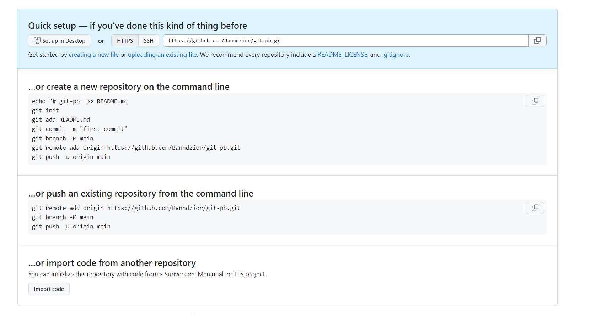

# Podstawy GIT

## Instalacja / Konfiguracja

* [X] Zainstaluj git


| OS | Install |
| - | - |
| Windows | [https://gitforwindows.org/](https://gitforwindows.org/) |
| Linux | apt-get install git |
| Mac OS | brew install git[https://git-scm.com/download/mac](https://git-scm.com/download/mac) |

* [X] Zainstaluj Visual Studio Code ([https://code.visualstudio.com/](https://code.visualstudio.com/))
* [X] Zainstaluj dodatki do Visual Studio Code >> Extensions

GitLens

* [X] *Zainstaluj GIT GUI ([https://www.hostinger.com/tutorials/best-git-gui-clients/](https://www.hostinger.com/tutorials/best-git-gui-clients/))


| GUI GUI | Url |
| - | - |
| GitExtensions | [http://gitextensions.github.io/](http://gitextensions.github.io/) |
| SourceTree | [https://www.sourcetreeapp.com/](https://www.sourcetreeapp.com/) |

* [X] Przygotuj konto na GitHub (załóż lub podaj login Kamilowi na Slack)
* [X] Sprawdź czy git działa

```dos
git --version
```

## GIT test

* [X] Sklonuj "dowolne" repozytorium z GitHub (https://github.com/Banndzior/git-pb)

```dos
git clone <url>
```

* [X] Pobierz najnowsze zmiany

```dos
git pull
```

## Moje repozytorium (katalog git-pb-student)

* [ ] Stwórz własny projekt na GitHub
* [ ] Skonfiguruj informacje o użytkowniku dla wszystkich lokalnych repozytoriów

```dos
git config --global user.name "nazwa"
git config --global user.email "adres email"
```

* [ ] Stworz katalogu w najkrótszej ścieżce, np. c:\git-pb-student\

```dos
cd c:\git\
mkdir git-pb-student
cd git-pb-student
```

* [ ] Zainicjuj repozytorium

```dos
git init
```

* [ ] Utwórz dowolny plik (tekstowy)

```dos
notepad pb.txt
```

* [ ] Zapisz zmiany w pliku
* [ ] Dodaj plik do sledzenia

```dos
git add .
```

* [ ] Zwersjonuj zmiany

```dos
git commit -m "Moje zmiany"
```

* [ ] Wrzuc zmiany na serwer

```dos
git remote add origin https://github.com/adres-repozytorium
git push -u origin main
```

* [ ] Spojrz na intro od GitHub



* [ ] Sprawdz pomoc na temat polecen

```dos
git --help push
```

* [ ] Zmodyfikuj plik pb.txt i wrzuc zmiany na server (add, commit, push)
